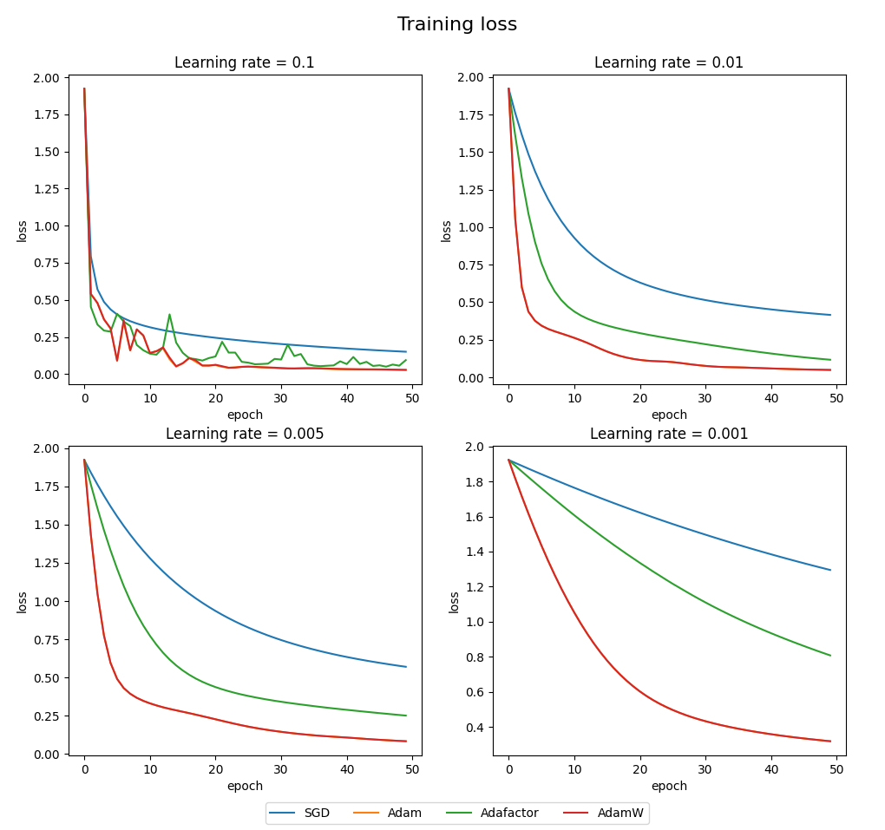
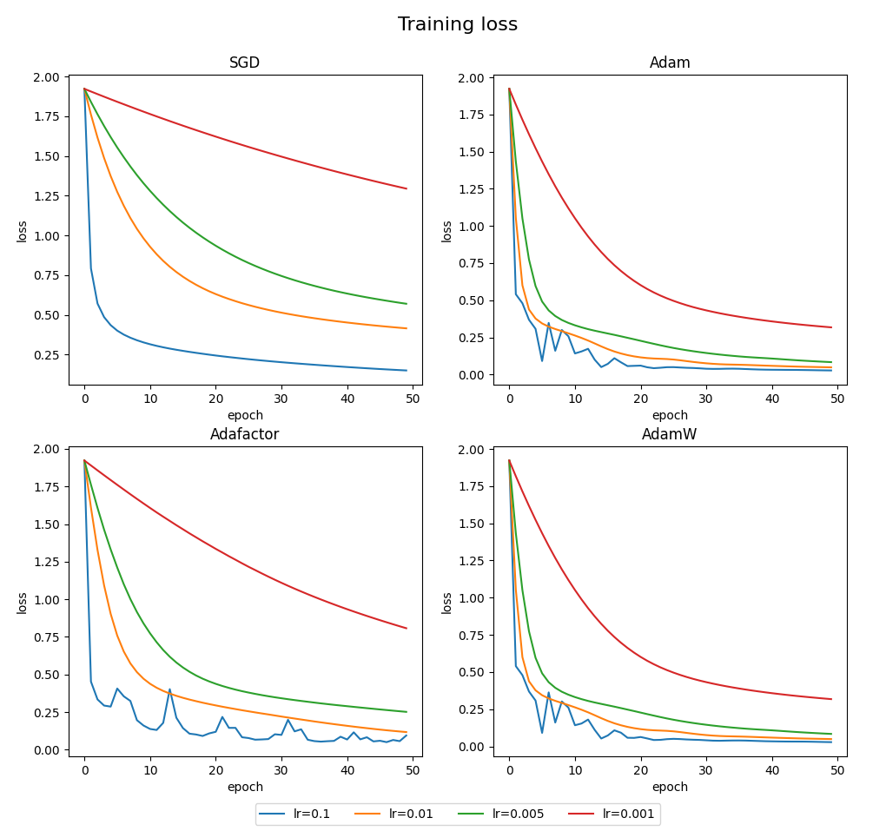
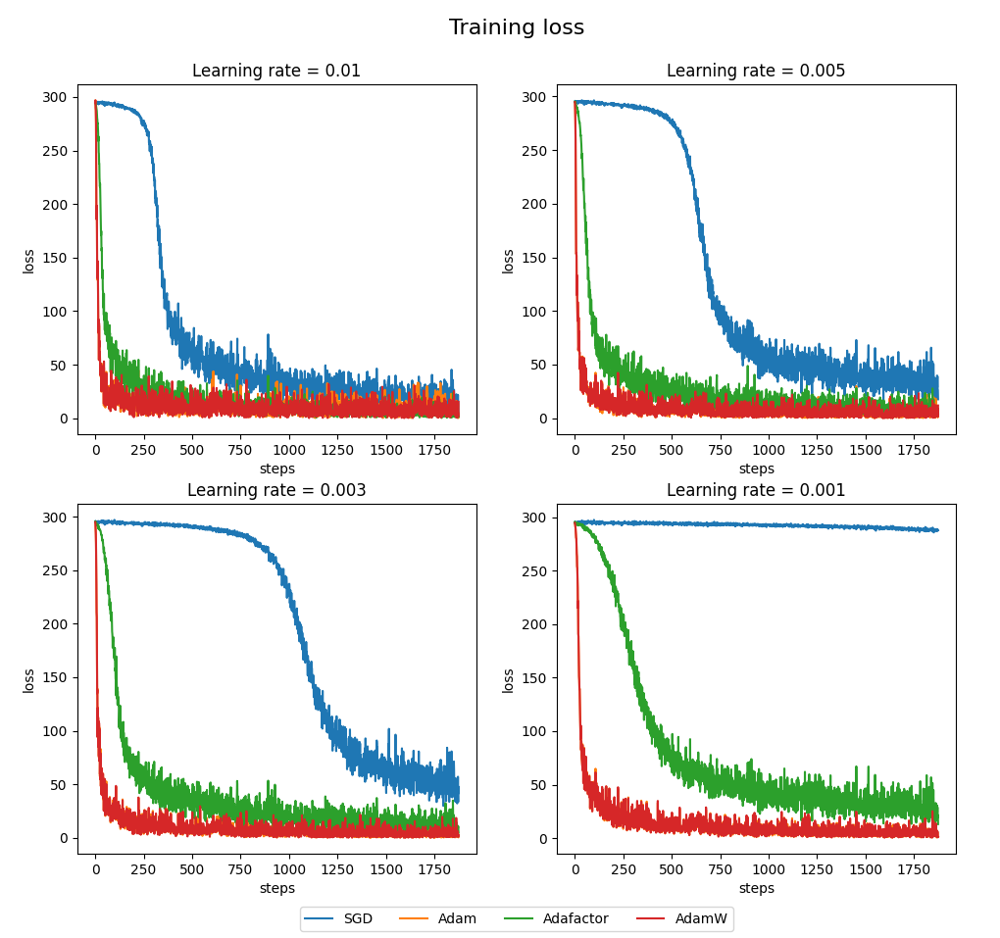
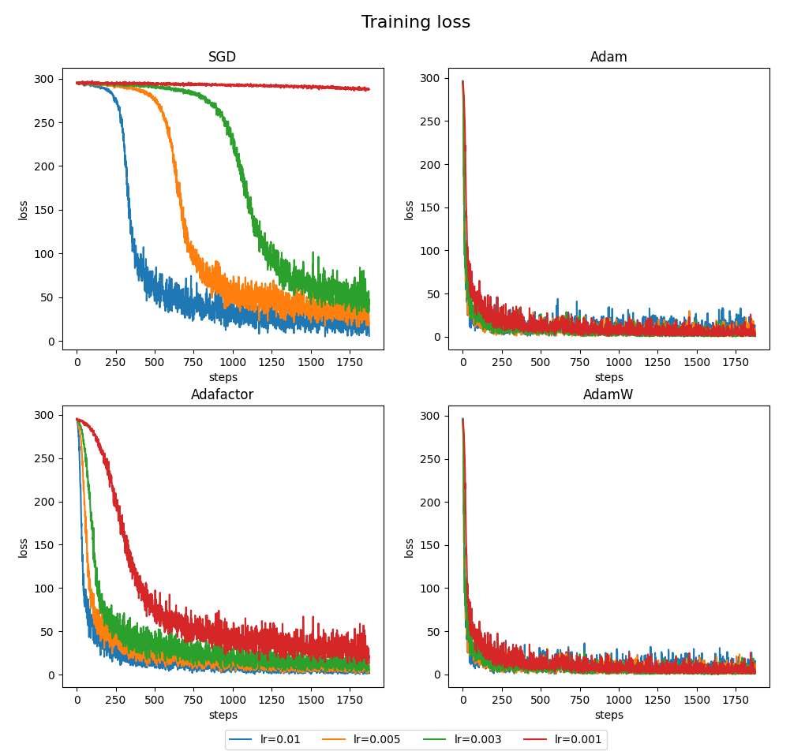
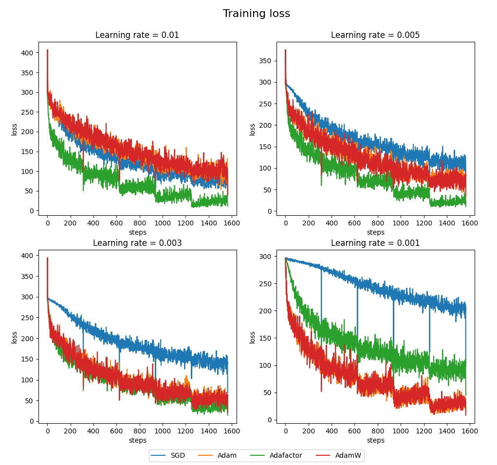
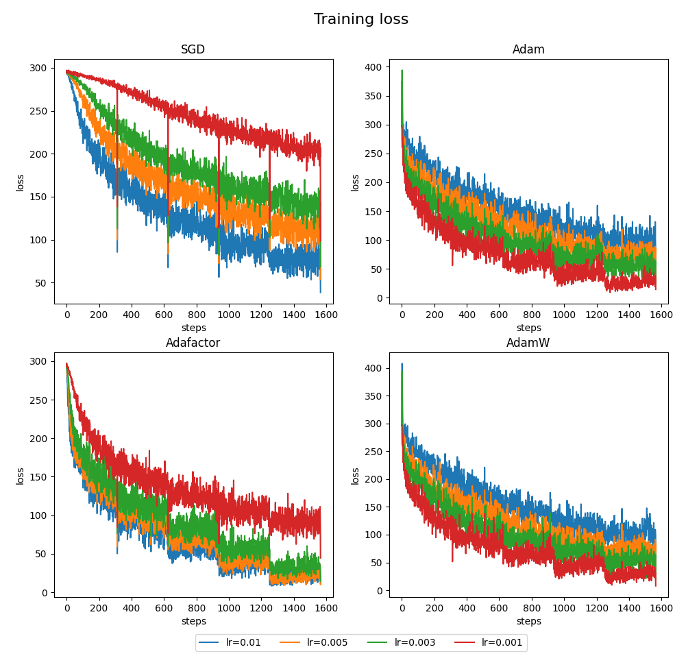

# ESTR3114 Project - Optimization algorithms

## Optimizers
SGD, Adam, AdamW, Adafactor

## Experiments
- 3-layer MLP on Iris dataset
- CNN1 with 2 convolutional layers and 3 feed forward layers on MNIST dataset
- CNN2 with 6 convolutional layers and 3 feed forward layers on CIFAR-10 dataset

## Results

### MLP

  
&nbsp; &nbsp; &nbsp; &nbsp;
  

### CNN1 (MNIST)

  
&nbsp; &nbsp; &nbsp; &nbsp;
  

### CNN2 (CIFAR-10)

  
&nbsp; &nbsp; &nbsp; &nbsp;
  

